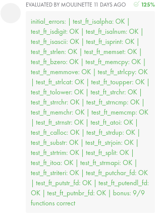

# 42_Libft
First Project for 42 Coding school. 


## Subscript
[Task](/PDF/Libft_subject.pdf)


## Overview about the functions
[Overview](/doc/Overview_about_function.md)

## Description
The functions in the Libft folder correspond to the Libft task of 42. In **main.c** the function is built up in code blocks and can be commented for the test of the respective function. To run the program use the ```make run``` command.

Use ```make fclean``` to clean the extra object file after using ```make run```. 

## Link for Test Libft
[francinette](https://github.com/xicodomingues/francinette)
For using fancinette you have to install
[norminette](https://github.com/42School/norminette)

## Goal

